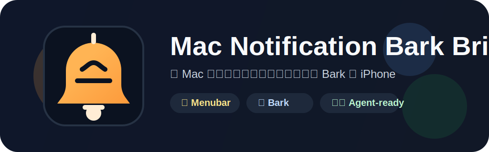

# Mac Notification Bark Bridge



一个运行在 macOS 上的 Swift 菜单栏后台工具，用来把 Mac 上当前可见的系统通知转发到 Bark，再推送到 iPhone。

它默认以 `LSUIElement` 菜单栏应用运行，不占 Dock；同时也保留了命令行调试模式，方便抓日志、看快照、验证解析规则。

## ✨ 它能做什么

- 常驻菜单栏后台运行
- 读取通知中心当前可见的通知 UI
- 提取通知来源、标题、正文
- 通过 Bark 转发到 iPhone
- 用去重窗口避免同一条通知被重复发送
- 提供原生“设置”窗口，而不是手改参数才能启动
- 输出日志和辅助功能树快照，方便排障

## 🔍 工作原理

这个项目不是通过私有 API 订阅系统通知，而是通过辅助功能读取 `NotificationCenter` 当前已经暴露出来的界面节点，再用启发式规则从节点树里提取：

- 通知来源
- 通知标题
- 通知正文

所以它的能力边界也很明确：

- 依赖“辅助功能”权限
- 只能读取系统当前暴露出来的通知界面
- 不会主动替你展开通知中心
- 如果通知中心当前没有展开，能读到的节点会更少，某些通知可能抓不到

换句话说，它适合“把 Mac 上可见通知同步到 iPhone”这类场景，但不是一个官方的“全量订阅所有系统通知”方案。

## 🚦 运行形态

项目有两种运行方式：

1. 没有传入用户参数时，默认启动为菜单栏后台 app。
2. 传入命令行参数时，按 CLI 调试工具运行。

如果你想显式进入菜单栏模式，也可以执行：

```bash
swift run mac-notification-bark-bridge --menu-bar
```

## 🔥 Fork 版本说明

这个 Fork 保留了原版的主流程，但专门补强了“安装、配置、排障”这条链路，方便 Agent 或人肉部署时快速落地。

### 1. 独特的价值

- 新增菜单栏内配置窗口，可以直接编辑规则，不用只靠命令行参数
- 新增 `config.example.jsonc` 参考文件，字段含义和示例都写在同一个文件里
- 新增首次使用提示，降低自定义构建版本第一次打开被系统拦住的概率
- 新增日志、快照、配置文件快捷入口，排查 iPhone 消息推送异常时更快定位 Mac 侧问题
- 新增更完整的规则模型，支持多设备 Key、多应用、多图标的转发方式

### 2. 简明的安装指导

1. 先执行 `./scripts/build-app.sh` 生成 `build/MacNotificationBarkBridge.app`
2. 右键应用选择“打开”，先把 macOS 的首次拦截处理掉
3. 到 `系统设置 > 隐私与安全性 > 辅助功能` 给当前实际运行的 app 授权
4. 打开 `~/Library/Application Support/MacNotificationBarkBridge/config.json`
5. 对照同目录的 `config.example.jsonc` 填好 `deviceKey` 和规则
6. 如果不确定配置是否生效，优先点菜单栏里的 `重新加载配置`

### 3. 如何让 Agent 快速帮你来安装和配置

如果让 Agent 帮你装，这个顺序最快：

1. 先把 `.app` 放到固定路径并启动一次，处理掉 macOS 的首次拦截
2. 到 `系统设置 > 隐私与安全性 > 辅助功能` 给当前实际运行的 app 授权
3. 打开 `~/Library/Application Support/MacNotificationBarkBridge/config.json`
4. 先把 `deviceKey` 填进去，再对照 `config.example.jsonc` 配规则
5. 通过菜单栏里的 `重新加载配置` 验证配置是否生效

Agent 部署时最关键的一点是：辅助功能权限要给“当前实际运行的 app”，不要只看文件名。

### 跟原版有什么区别

- 原版更偏命令行调试，这个 Fork 增加了菜单栏内配置和规则编辑能力
- 原版需要自己理解参数和配置文件，这个 Fork 多了 `config.example.jsonc` 和首次使用提示
- 原版更适合开发者自己跑，这个 Fork 更适合给自己、Agent 或同事快速部署后直接用
- 原版更聚焦抓通知，这个 Fork 额外把“安装、授权、排障”这些容易卡住的地方补齐了

### 修复了什么，解决了什么问题

- 解决了第一次打开时不知道去哪里配 Bark Key 的问题
- 解决了换构建产物后辅助功能权限失效、但不好判断原因的问题
- 解决了配置文件写错后，不知道先看哪个参考文件的问题
- 解决了 iPhone 侧推送不稳定时，没法快速确认 Mac 侧是否已经抓到通知、是否已经转发的问题
- 解决了多设备、多应用、多规则场景下靠手工维护太累的问题

## 🧭 快速开始

更完整的安装说明见 [INSTALLATION.md](./INSTALLATION.md)。

### 1. 打包菜单栏 App

```bash
./scripts/build-app.sh
```

默认会生成一个带固定 bundle identifier requirement 的本地 ad-hoc 签名 `.app`。这样辅助功能授权可以按 `local.codex.MacNotificationBarkBridge` 复用，而不是跟着每次构建后的 `cdhash` 变化。

如果你明确要用自己的签名证书，可以这样打包：

```bash
SIGNING_IDENTITY="Developer ID Application: Your Name" ./scripts/build-app.sh
```

生成结果位于：

```text
build/MacNotificationBarkBridge.app
```

### 2. 启动 App

可以双击启动，也可以命令行启动：

```bash
open build/MacNotificationBarkBridge.app
```

这是一个 `LSUIElement` 菜单栏应用，启动后不会出现在 Dock，只会出现在菜单栏。

### 3. 打开设置并填写 Bark Key

第一次启动后，程序会在这里生成配置文件：

```text
~/Library/Application Support/MacNotificationBarkBridge/config.json
```

你可以通过菜单栏图标打开 `设置…`，也可以直接编辑这个文件。

至少需要填好：

- `deviceKey`

### 4. 授予辅助功能权限

去这里开启权限：

```text
系统设置 > 隐私与安全性 > 辅助功能
```

推荐勾选这个固定路径的 app：

```text
build/MacNotificationBarkBridge.app
```

如果你是从别的路径启动的，也要确认辅助功能里勾选的是“当前实际在运行的那个 app 或可执行文件”。

### 5. 开始监听

完成配置后，菜单栏里可以直接使用：

- `设置…`
- `授权辅助功能…`
- `重新加载配置`
- `打开配置文件`
- `打开日志文件`
- `打开最近快照`
- `立即扫描`
- `开始监听` / `停止监听`
- `退出`

## ⚙️ 配置文件

配置文件示例：

```json
{
  "deviceKey": "YOUR_BARK_KEY",
  "barkBaseURL": "https://api.day.app",
  "sourceFilter": "Messages",
  "pollInterval": 2,
  "dedupeWindow": 300,
  "dryRun": false,
  "promptForAccessibility": true
}
```

各字段含义：

| 字段 | 含义 |
| --- | --- |
| `deviceKey` | Bark 设备 Key，必填 |
| `barkBaseURL` | Bark 服务地址，默认 `https://api.day.app` |
| `sourceFilter` | 只转发来源、标题或正文中包含该文本的通知；留空表示不过滤 |
| `pollInterval` | 轮询间隔，单位秒，默认 `2` |
| `dedupeWindow` | 去重窗口，单位秒，默认 `300` |
| `dryRun` | 为 `true` 时只记日志，不真正调用 Bark |
| `promptForAccessibility` | 是否在需要时主动触发系统辅助功能授权提示 |

如果 `deviceKey` 为空，菜单栏 app 仍然会启动，但会提示你补齐配置。

## 🧪 CLI 调试模式

命令行模式适合做一次性扫描、抓树、做夹具测试。

### 基本用法

```bash
swift run mac-notification-bark-bridge \
  --device-key YOUR_BARK_KEY \
  --source-filter Messages
```

### 只扫描一次

```bash
swift run mac-notification-bark-bridge \
  --device-key YOUR_BARK_KEY \
  --source-filter Messages \
  --once
```

### 只观察，不发 Bark

```bash
swift run mac-notification-bark-bridge \
  --device-key test \
  --dry-run \
  --dump-tree \
  --once
```

### 用夹具验证解析逻辑

```bash
swift run mac-notification-bark-bridge \
  --device-key test \
  --fixture Tests/MacNotificationBarkBridgeTests/Fixtures/sample-notification-tree.json \
  --dry-run \
  --once
```

### 关闭辅助功能弹窗

```bash
swift run mac-notification-bark-bridge \
  --device-key test \
  --no-accessibility-prompt \
  --once
```

命令行支持的主要参数：

- `--device-key <key>`
- `--bark-base-url <url>`
- `--source-filter <text>`
- `--poll-interval <seconds>`
- `--dedupe-window <seconds>`
- `--dry-run`
- `--once`
- `--dump-tree`
- `--fixture <path>`
- `--no-accessibility-prompt`

## 📡 Bark 调用方式

当前使用 Bark 的 `POST /<deviceKey>` 接口，表单字段会带：

- `title`
- `body`
- `group`
- `level`
- `isArchive`

其中通知标题会优先按 `来源 | 标题` 的形式组织；如果解析出的来源和标题相同，则只发一个标题，避免重复。

## 🔒 日志与隐私

日志和最近一次辅助功能树快照会写到：

```text
~/Library/Application Support/MacNotificationBarkBridge/Logs/bridge.log
~/Library/Application Support/MacNotificationBarkBridge/Logs/latest-tree.json
```

隐私相关行为：

- `bridge.log` 默认不会记录通知正文原文
- 日志里只会记录来源、标题、正文长度等摘要信息
- `latest-tree.json` 仍然是原始辅助功能快照，可能包含完整通知内容

如果你要把 `latest-tree.json` 发给别人排障，建议先自行脱敏。

## 🧯 常见问题

### 为什么扫不到通知

先看两件事：

- 辅助功能权限是否真的给到了当前运行的 app
- 通知中心当前是否真的把那条通知暴露在可读的 UI 节点里

这个项目不会主动展开通知中心，所以如果通知中心是收起状态，可抓到的内容可能明显变少。

### 为什么会转发两次

同一条通知有时会同时以不同 UI 形式出现，例如横幅和通知中心列表。项目里已经做了去重，但如果通知内容本身被系统拆成了两个不同节点，仍可能需要按实际机器情况再调整解析规则。

可以先把 `dedupeWindow` 适当调大，再看日志和快照确认是不是两条不同节点。

### 一直提示辅助功能权限不对

优先检查：

- 你勾选的是不是当前实际运行的那个 app 路径
- 你是不是换过构建产物路径
- 你是不是在命令行和 `.app` 之间来回切换运行

推荐固定使用：

```text
build/MacNotificationBarkBridge.app
```

并通过这个路径启动，避免权限绑到别的二进制上。

### 打不开或提示配置异常时先看哪里

先看这两个文件：

- 实际生效配置：`~/Library/Application Support/MacNotificationBarkBridge/config.json`
- 配置参考文件：`~/Library/Application Support/MacNotificationBarkBridge/config.example.jsonc`

如果 `config.json` 里的字段写错了，程序会直接报配置错误。此时最省时间的做法是先对照 `config.example.jsonc` 修正字段，再重新加载配置。

### 日志在哪里

菜单栏里可以直接点：

- `打开日志文件`
- `打开最近快照`

也可以手动去：

```text
~/Library/Application Support/MacNotificationBarkBridge/Logs/
```

## 🛠️ 开发建议

- 真机上先用 `--dump-tree --once` 看你机器的通知中心树结构，再微调解析规则
- 如果你只关心某个应用，优先配置 `sourceFilter`
- 做解析规则回归时，优先保存快照夹具再写测试，避免每次都靠手工复现

## 📄 License

本项目使用 MIT 许可证，见 `LICENSE`。

## 📝 Release Notes

发布说明模板见 `docs/RELEASE_NOTES_TEMPLATE.md`。
GitHub 自动生成发布说明的分类规则见 `.github/release.yml`。
